# Peer Review Assignment: Book Shop API

This repository contains the implementation of a book shop API with various routes and functionalities. Below are the tasks that have been completed, along with details and sample outputs.

---

## Table of Contents

1. [Task 1: Get All Books](#task-1)
2. [Task 2: Get Book Details by ISBN](#task-2)
3. [Task 3: Get Books by Author](#task-3)
4. [Task 4: Get Books by Title](#task-4)
5. [Task 5: Get Book Reviews](#task-5)
6. [Task 6: Register New User](#task-6)
7. [Task 7: Login](#task-7)
8. [Task 8: Add or Modify Book Review](#task-8)
9. [Task 9: Delete Book Review](#task-9)
10. [Task 10: Get Books Using Axios with Promises](#task-10)
11. [Task 11: Get Book by ISBN Using Axios with Promises](#task-11)
12. [Task 12: Get Books by Author Using Axios with Promises](#task-12)
13. [Task 13: Get Books by Title Using Axios with Promises](#task-13)

---

## Task 1: Get All Books

**Objective**: Complete the code for retrieving the list of books available in the shop.

**Hint**: Use the `JSON.stringify` method to display the output neatly.

**Testing**: Test the output on Postman.

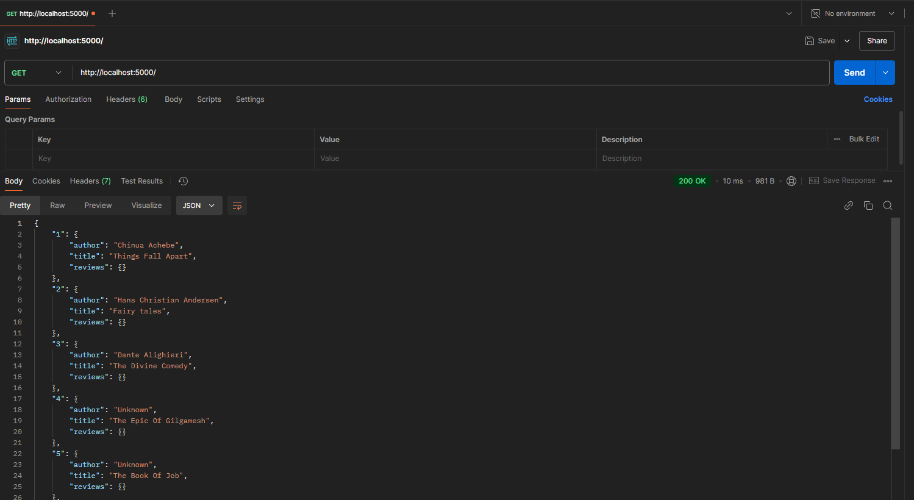

---

## Task 2: Get Book Details by ISBN

**Objective**: Retrieve the book details based on ISBN from the request parameters.

**Hint**: Retrieve the ISBN from the request parameters.

**Testing**: Test the output on Postman.

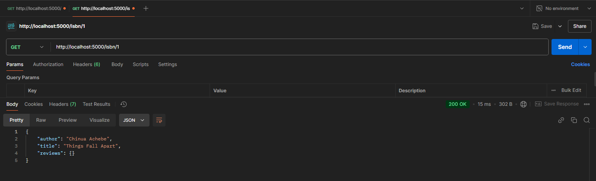

---

## Task 3: Get Books by Author

**Objective**: Retrieve the books based on the author from the request parameters.

**Hint**: Iterate through the `books` array and check for matching authors.

**Testing**: Test the output on Postman.

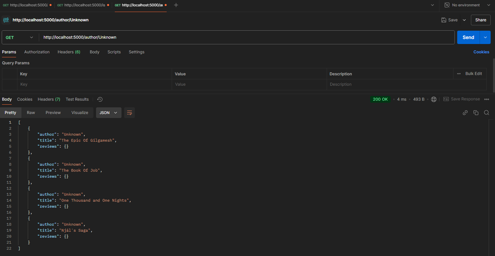

---

## Task 4: Get Books by Title

**Objective**: Retrieve the books based on the title from the request parameters.

**Hint**: Similar to Task 3, but match by title instead of author.

**Testing**: Test the output on Postman.

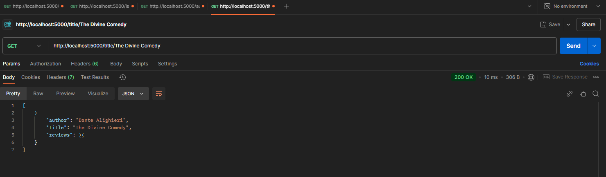

---

## Task 5: Get Book Reviews

**Objective**: Retrieve the book reviews based on ISBN from the request parameters.

**Testing**: Test the output on Postman.

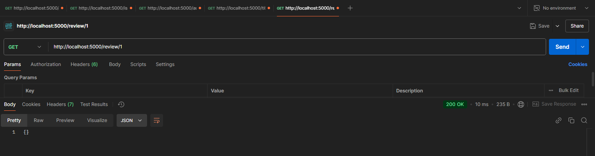

---

## Task 6: Register New User

**Objective**: Register a new user with a username and password.

**Hint**: If the username already exists, display an error message. Ensure the username and password are both provided.

**Testing**: Test the output on Postman.

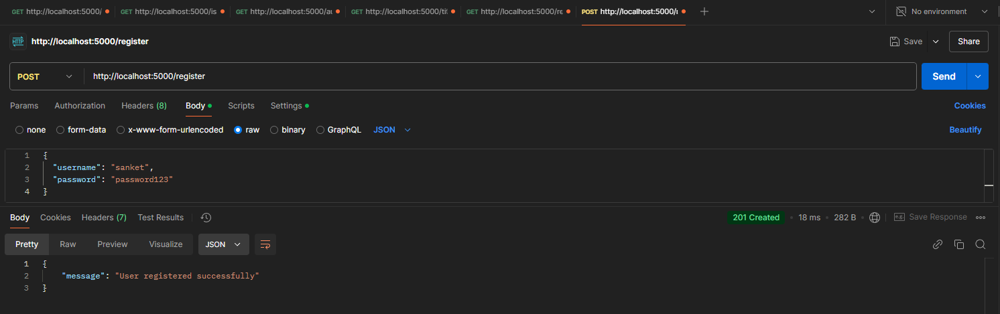

---

## Task 7: Login

**Objective**: Log in as a registered user and authenticate the credentials.

**Hint**: Use JWT tokens for session management and validation.

**Testing**: Test the output on Postman.

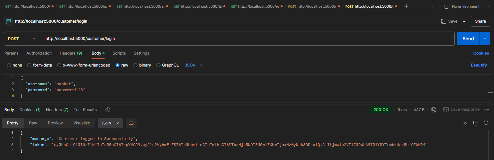

---

## Task 8: Add or Modify Book Review

**Objective**: Add or modify a book review. A user can modify their review on the same ISBN, but reviews from different users are stored separately.

**Testing**: Test the output on Postman.

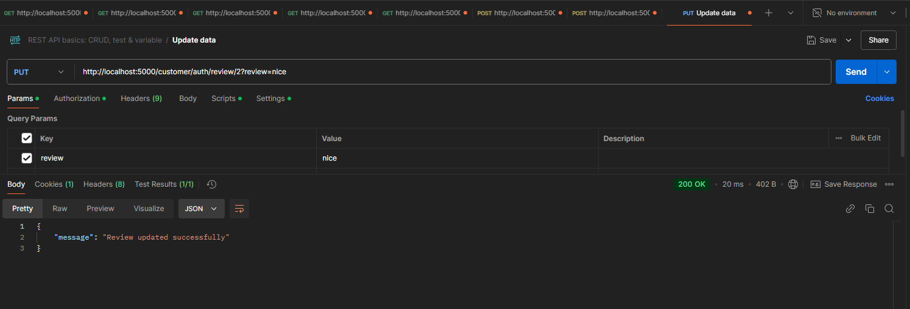

---

## Task 9: Delete Book Review

**Objective**: Delete a book review based on the session username. A user can only delete their own reviews.

**Testing**: Test the output on Postman.

---

## Task 10: Get Books Using Axios with Promises

**Objective**: Use Axios with Promise callbacks or async/await to retrieve the list of books.

**Testing**: Test the output on Postman.

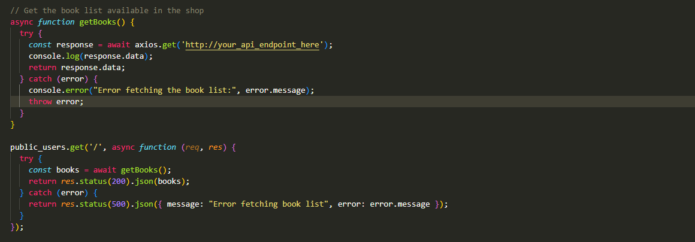

---

## Task 11: Get Book by ISBN Using Axios with Promises

**Objective**: Use Axios with Promise callbacks or async/await to retrieve the book details based on ISBN.

**Testing**: Test the output on Postman.

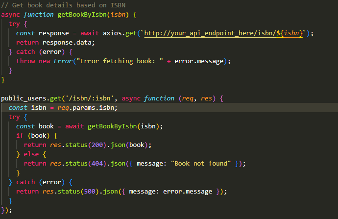

---

## Task 12: Get Books by Author Using Axios with Promises

**Objective**: Use Axios with Promise callbacks or async/await to retrieve books by author.

**Testing**: Test the output on Postman.

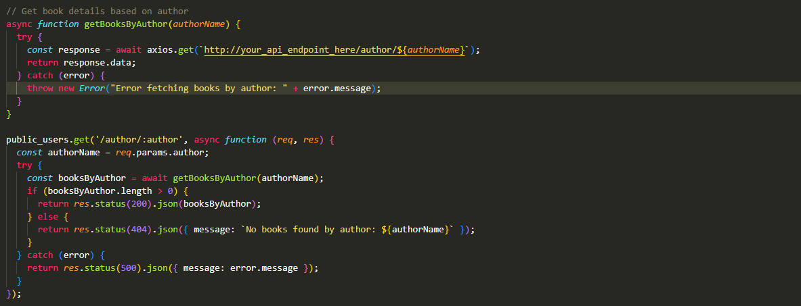

---

## Task 13: Get Books by Title Using Axios with Promises

**Objective**: Use Axios with Promise callbacks or async/await to retrieve books by title.

**Testing**: Test the output on Postman.

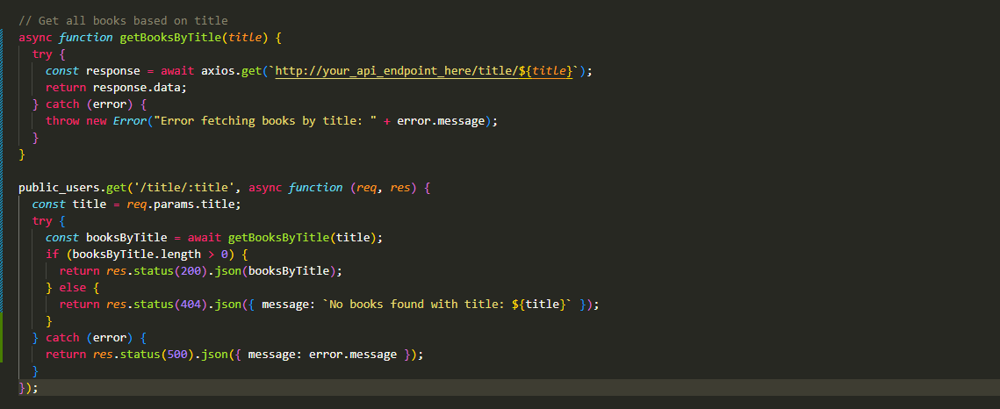

---

## Contributing

1. Fork the repository.
2. Create a new branch (`git checkout -b feature-branch`).
3. Make changes and commit (`git commit -am 'Add new feature'`).
4. Push to the branch (`git push origin feature-branch`).
5. Open a pull request.

---

## License

This project is licensed under the MIT License - see the [LICENSE](LICENSE) file for details.
